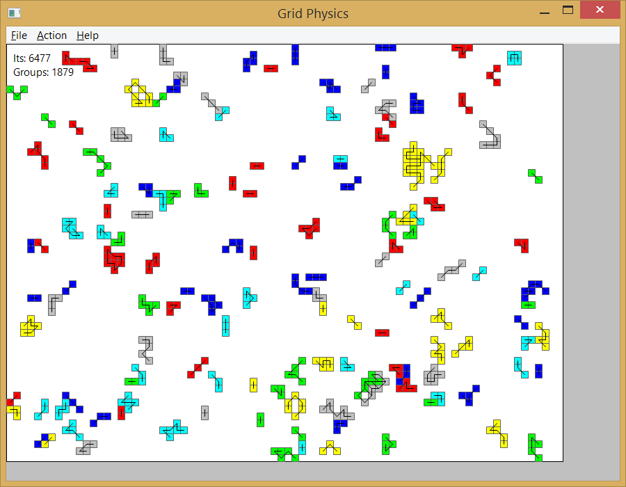

# grid-physics
Exploring the possibilities for flexible movement on a grid.

Previous models has typically provided for each atom to move individually but that leads to limited movement on a grid. 

By searching for all subgroups of a bonded set of atoms and allowing each subgroup to move as a whole we can achieve much better flexibility.
